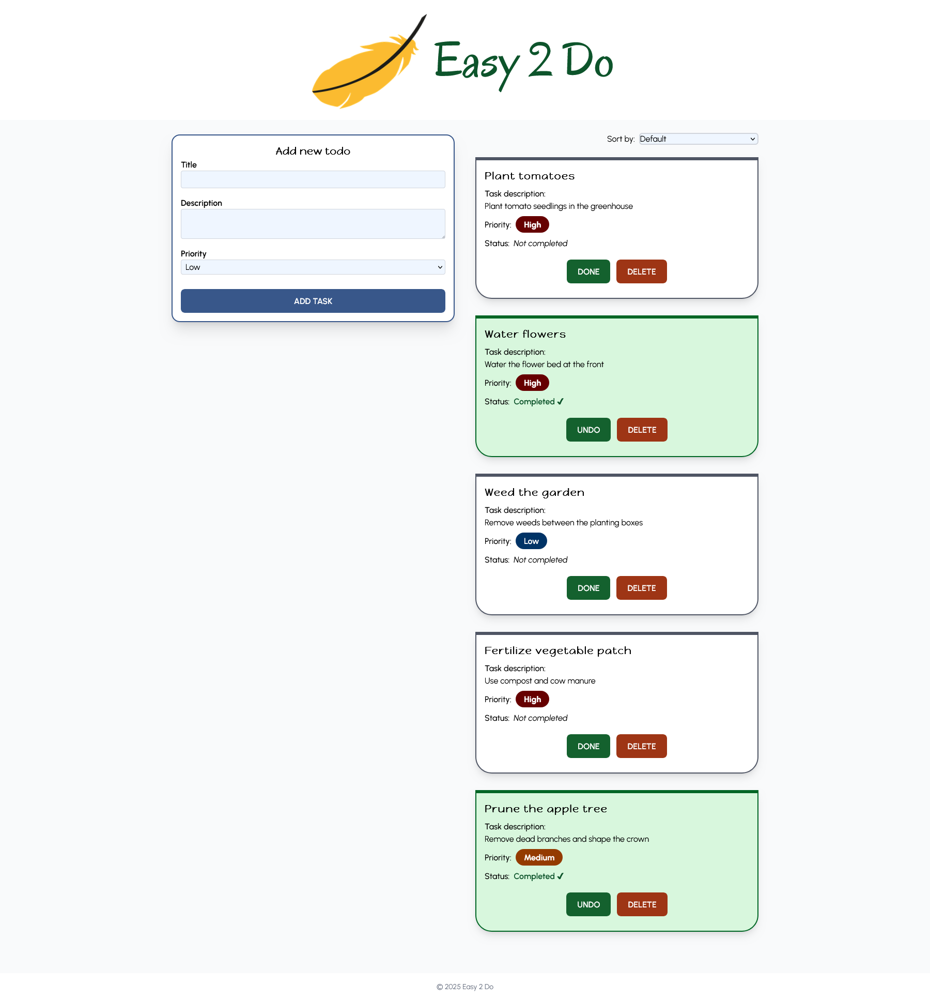
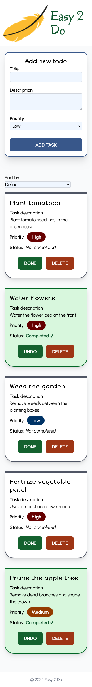

# 🪶 Easy 2 Do

## 🔎 Project Description

Easy 2 Do is a responsive todo app built with React and TypeScript. It allows users to add, prioritize, and manage tasks, with localStorage support. The app supports marking todos as complete or incomplete and includes sorting functionality. The UI is clean and styled with Tailwind CSS.

## 🌍 Live Demo

👉 [Live demo of Easy 2 Do](https://medieinstitutet.github.io/fed24d-the-last-todos-MalinRosenquist/)

## ✨ Features

- Add todos with title, description and priority level
- Store todos in localStorage to persist tasks between sessions
- Sort todos by status, priority, title and latest added (default)
- Toggle todos as complete or incomplete, with dynamic button and styling
- Remove todos from list

## 🛠️ Tech Stack


## 📦 Installation

```shell
git clone https://github.com/Medieinstitutet/fed24d-the-last-todos-MalinRosenquist
cd fed24d-the-last-todos-MalinRosenquist
npm install
```

## ▶️ Running the Project (Dev)

```shell
npm run dev
```

## 👩‍💻 Authors

- [Malin Rosenquist](https://www.github.com/malinrosenquist)

## 📸 Screenshots





## 📄 License

This project is open source and available under the [MIT License](./LICENSE).
